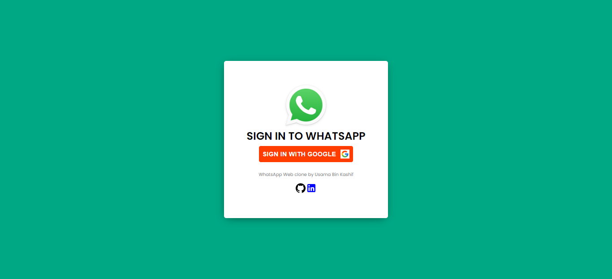
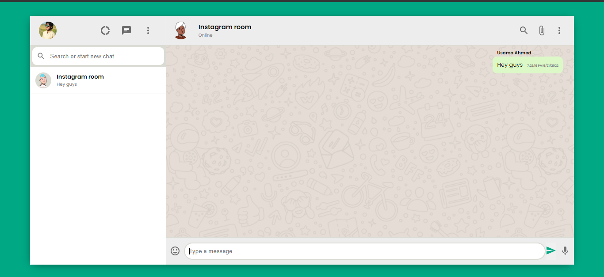

# WhatsApp Web Clone

This is a solution to the [WhatsApp Web Clone](https://wwc-usamabinkashif.netlify.app/). Learned it from [Clever Programmer Youtube Channel](https://www.youtube.com/watch?v=pUxrDcITyjg&t=11954s&ab_channel=CleverProgrammer).

Table of contents

- [Overview](#overview)
  - [Screenshots](#screenshots)
  - [Links](#links)
- [My process](#my-process)
  - [Built with](#built-with)
  - [What I learned](#what-i-learned)

## Overview

### Things coverd in this built

Users are able to

- Sign in with Google Authentication.
- Users can add rooms like whatsapp groups.
  - all the other user can see your chat and can chat with you(will fix this in future like actual whatsapp)
  - Users can delete the room.
  - Its whatsapp web clone so for better results try it on desktop or laptop.
- Users can log out.

### Screenshots

<table>
        <tr>
		    <td>
                
            </td>
          <td>
                
            </td>
        </tr>
</table>

### Links

- [Solution](https://github.com/UsamaBinKashif/whatsapp-web-clone)
- [Live Page](https://wwc-usamabinkashif.netlify.app/)

## My process

### Built with

- HTML using BEM naming convention
- SCSS (css preprocessor)
- Flexbox
- CSS Grid
- [React](https://reactjs.org/) - JS library
- [Vite](https://vitejs.dev/) - Next Generation Frontend Tooling

- [Firebase](https://firebase.google.com/) - For Backend (Authentication, Database)

- [Netlify](https://www.netlify.com/) - For Hosting

### What I learned

This challenge was a great learning opportunity, I learned the react context for complex state management and also I discoverd Firebase features like Google Auth and Firestore Database.

(<a href="#top">back to top</a>)

